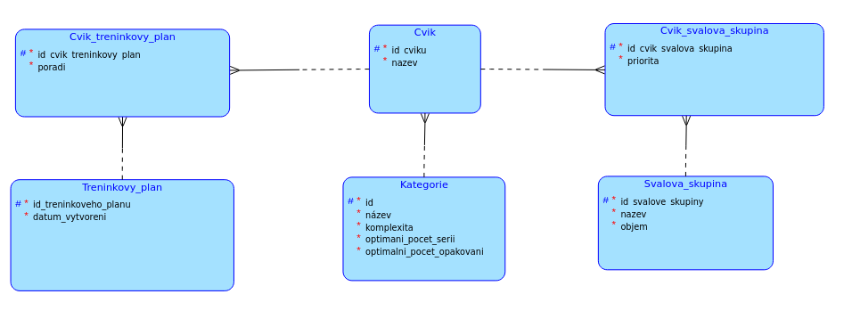

# BI-TJV Semestral project

## První kontrolní bod
Semestrálka je na téma fitness. Budeme mít uloženou databázi cviků včetně informací o 
jejich komplexitě a jaké svalové skupiny zapojují. Bude si moci zobrazit cviky a filtrovat je podle 
různých kritérií. Také si bude moci pomocí dotazníku vytvořit jednodenní tréninkový plán.

### Business operace
Uživatel si vyplněním dotazníku bude moci nechat vygenerovat cviky na jeden trénink.
Například si zvolí, že chce cvičit prsní svaly a ramena, zadá, jestli chce spíše 
budovat svalovou hmotu, a nebo budovat sílu. Dále může třeba zadat čas, který má na trénink vyhrazený.
Aplikace mu vrátí které cviky má cvičit, kolik serií a kolik opakování.

### Komplexní dotaz v serverové části
Komplexní dotaz proběhne při vyhodnocování dotazníku. Podle nějaké logiky bude muset vybrat cviky pro 
dané svalové partie, nastavit počet setů a opakování podle času a cíle uživatele a vrátit uživateli 
tréninkový plán na míru.

### Entity

- Svalová_skupina/Objem určuje jakousi velikost/důležitost dané skupiny
- Cvik_Svalova_skupina/Priorita má označovat, jestli daný cvik cvičí sval primárně (=nejvíce), 
sekundárně (=méně), atd...
- Kategorie/Komplexita určuje o jak fyzicky náročný cvik se jedná, z čehož se dá určit i přestávky 
mezi sériemi, zaměření tréninku atd...
