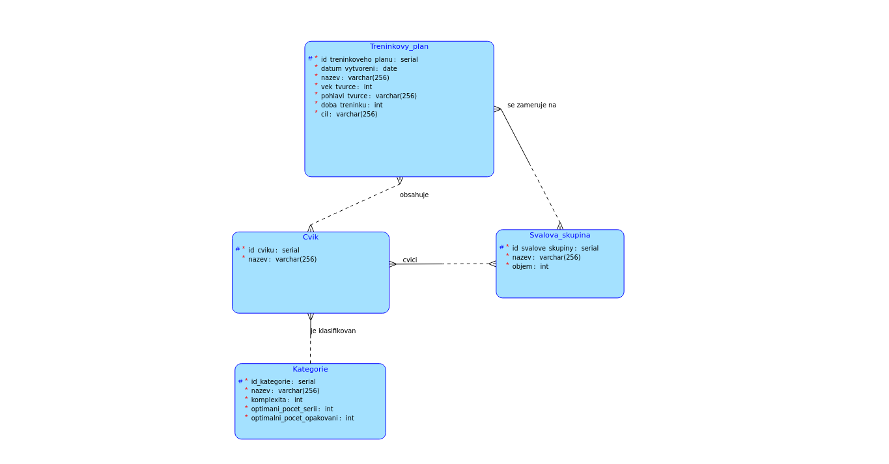

# Training Plan Generator

## How to run this application

- Start SpringBootAplication (cz.cvut.fit.training_plan_generator.TrainingPlanGenerator.main) 
to run backend on http://localhost:8080
  - Make sure you have JDK Amazon Corretto 17 (17.0.10)
- Run ```npm install``` and then ```npm start``` (in src/main/js) to start frontend on http://localhost:3000

### API Documentation

You can view documentation at:
1. http://localhost:8080/swagger-ui/index.html
2. http://localhost:8080/v3/api-docs

### Popis semestrální práce
Semestrálka je na téma fitness. Budeme mít uloženou databázi cviků včetně informací o 
jejich komplexitě a jaké svalové skupiny zapojují. V klientovi si bude uživatel zobrazit
jednoduchou databázi cviků a svalových partií. 

Také si bude moci pomocí dotazníku vytvořit jednodenní tréninkový plán. Ten si poté bude 
moci zobrazit v seznamu vytvořených tréninkových plánu, rozkliknout si jeho detaily a 
vyexportovat do PDF.

#### Business operace
Uživatel si vyplněním dotazníku bude moci nechat vygenerovat cviky na jeden trénink.
Zvolí si, že chce cvičit např. prsní svaly a ramena, zadá, jestli chce spíše 
budovat svalovou hmotu, a nebo nabírat sílu. Dále vyplní čas, který má na trénink vyhrazený, 
věk, pohlaví a název plánu.
Aplikace mu vrátí které cviky má cvičit, kolik serií a kolik opakování.

#### Komplexní dotaz v serverové části
Komplexní dotaz proběhne při vyhodnocování dotazníku. Podle jednoduché hard-coded logiky vybere
cviky, které cvičí právě uživatelem zadané svalové partie. Počet a typ cviků odpovídá uživatelovu 
cílu a času, díky čemuž dostane tréninkový plán na míru.

#### Entity

- Svalová_skupina/Objem určuje jakousi velikost/důležitost dané skupiny
- Kategorie/Komplexita určuje o jak fyzicky náročný cvik se jedná, z čehož se dá určit i přestávky 
mezi sériemi, zaměření tréninku atd...
